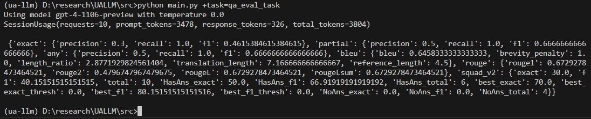

# UA-LLM: LLMs for Ukrainian NLP

<p align="center">
    <a href="#">
        
    </a>
    <a href="#">
        
    </a>
    <a href="#">
       
    </a>
    <a href="#">
        
    </a>
    <a href="#">
       
    </a>
</p>

This repository contains complete pipelines, as well as scripts and individual components, that help to adapt, train, evaluate, and leverage various Large Language Models (LLMs) for a wide range of Ukrainian NLP tasks.

## Installation

To use the code in this repository, you need to have Conda installed on your system. You can then create a new Conda environment with the required dependencies by running the following command:

```
conda env create -f environment.yml
```

This will create a new Conda environment called `ua-llm` with all the required dependencies installed. You can then activate this environment by running the following command:

```
conda activate ua-llm
pre-commit install  # required only for contributors
```

## Usage

Get your access credentials from LLM provider.

Go to the source code directory:
```
cd src
```

Fill in the model configs with obtained credentials. See example command below for OpenAI provider.
```
python tools/set_auth.py --openai_org_id <your_org> --openai_api_key <your_api_key>
```
or use the command similar to the following one for any other supported LLM provider (run with `--help` to see the arguments list).
```
python tools/set_auth.py --cohere_api_key <your_api_key>
```

Run example task to get predictions and evaluate them (Note, that you will be charged by LLM provider for each request, so it's better to run the next command with trial subscription or api key):
```
python main.py +task=qa_eval_task
```
As a result, you will get the following output:



Feel free to explore evaluation task config and other files in `configs/` directory to get more details about the task and how it works. You may also want to learn more about [Hydra framework](https://hydra.cc/docs/intro/) and [OmegaConf](https://omegaconf.readthedocs.io/en/2.3_branch/).

Now you are ready to use your own datasets for evaluation or adapt any supported task for your specific needs.

## Supported LLMs

- OpenAI GPT models
- Cohere Command
- Replicate.com models (LLaMA, Mistral, etc.)

## Supported tasks

- Context-based Question Answering (CBQA)
- Context-based Question Answering data generation/annotation

## Contributing

If you would like to contribute to this repository, please create a new branch and submit a pull request with your changes. Any contributions are welcome!

## License

This repository is licensed under the Apache 2.0 License. See the [LICENSE](LICENSE) file for more details.
